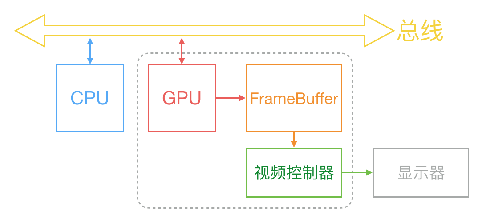
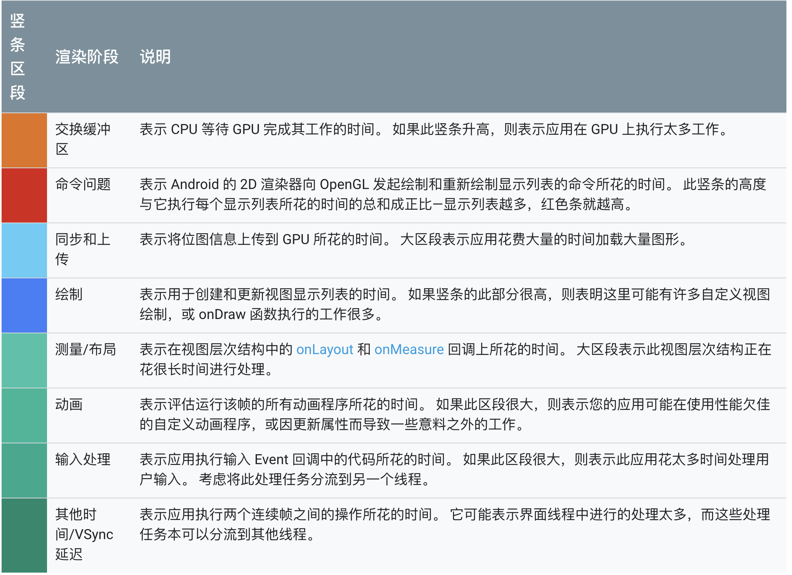

# Android基础题-性能优化

## 目录

1. ANR的现象，原因和分析解决方案
2. 内存泄露的原因和分析解决方案
3. Bitmap占用内存的大小
4. 如何优化Bitmap的加载？
5. 如何定位和优化滑动卡顿？
6. 如何评估和测量App的性能？

* **ANR的现象，原因和分析解决方案**

1. ANR全称：Application Not Responding，也就是应用程序无响应。如果App在前台，系统会提示一个对话框给用户，让用户有机会强制杀死App进程。
2. Android系统中，ActivityManagerService(简称AMS)和WindowManagerService(简称WMS)会检测App的响应时间，如果App在特定时间无法响应屏幕触摸或键盘输入事件，或者特定事件没有处理完毕，就会出现ANR。
3. 触发ANR的情况：
	App在前台的话，5秒内无法响应屏幕触摸事件或键盘输入事件，或者广播事件。
	App在后台的话，广播处理事件的时间过长也会导致ANR。

	input事件前后台5s
	Porvider事件前后台10s
	Broadcast前台10s，后台60s
	Service前台20s，后台200s
4. 导致ANR可能的原因
	App在主线程执行耗时的IO操作
	App在主线程进行复杂计算
	App在主线程等待其它进程的同步binder回调时，其它进程返回时长很久
	App主线程等待其它线程的synchronized锁
5. 调试方法
	分析ANR的Log，重要进程的各个线程的信息保存在：/data/anr/traces.txt
	traces文件和CPU使用情况保存在 /data/system/dropbox目录
	应用开启严格模式StrictMode
	开发者选项里开始后台ANR对话框
	利用Traceview分析耗时
6. 发生ANR的Trace信息主线程是空闲状态或者停留的位置是非耗时的原因可能是什么？	可能是抓取trace过去耗时而错过现场
	可能是主线程消息队列堆积了大量消息而最后抓取快照一刻只是瞬时状态，可以是广播的「queued-work-looper」一直在处理sp操作。	

* **内存泄露的原因和分析解决方案**

内存泄露是指用动态存储分配函数动态开辟的空间，在使用完毕后未释放，结果导致一直占据该内存单元。直到程序结束。即所谓的内存泄漏。也就是内存空间使用完毕后没有及时回收。Java虚拟机的垃圾回收机制方便了Java开发者的同时，日常开发也不可避免的遇到内存泄露的问题。Java采用引用计数的方式标记和操作对象，Java虚拟机会定期通过对象的引用计数和可达性分析来标记对象是否需要回收，来回收那些无引用的Java对象。简单的例子，如果程序退出后某处还持有某个需要被回收的对象的引用，那么就造成了内存泄露，根据时间的长度和泄露内存的大小，影响程序性能甚至导致OOM。

Android中常见的内存泄露的例子,比如说Activity的context被静态变量，单例等持有导致退出页面后，Activity资源得不到回收释放。

分析内存泄露的方式有以下几种：
1. Debug版本的应用包可以考虑集成内存泄露检测工具,例如Apache开源的LeakCanary
2. 导出和分析hprof(Heap Profilling)文件，可以通过adb shell am dumpyheap命令导出，也可以通过Android Studio自带的Android Profile工具中的内存管理工具导出。导出后的hprof文件可以通过Android Studio浏览和分析具体对象的内存占用和引用信息。

如何知道对象是否被回收了?

可以通过手动GC + ReferenceQueue + WeakReference

所谓ReferenceQueue，也就是引用队列，创建 Reference 的时候指定了 ReferenceQueue，并且对象的可达性发生了变化时,垃圾回收器将已注册的引用对象添加到ReferenceQueue。

WeakReference 创建时，传入一个 ReferenceQueue 对象。当被 WeakReference 引用的对象的生命周期结束，一旦被 GC 检查到，GC 将会把该对象添加到 ReferenceQueue 中，待 ReferenceQueue 处理。当 GC 过后对象一直不被加入 ReferenceQueue，说明它可能存在内存泄漏。

* **Bitmap占用内存的大小**

Bitmap占用内存的大小和以下几个因素有关：

* 图片宽高

* 色彩格式(Alpha_8, RGB_565, ARGB_4444, RGBA_8888等)其中RGBA_8888一个像素4个字节

```C++
int SkColorTypeBytesPerPixel(SkColorType ct) {
    switch (ct) {
        case kUnknown_SkColorType:      return 0;
        case kAlpha_8_SkColorType:      return 1;
        case kRGB_565_SkColorType:      return 2;
        case kARGB_4444_SkColorType:    return 2;
        case kRGBA_8888_SkColorType:    return 4;
        case kBGRA_8888_SkColorType:    return 4;
        case kRGB_888x_SkColorType:     return 4;
        case kRGBA_1010102_SkColorType: return 4;
        case kRGB_101010x_SkColorType:  return 4;
        case kGray_8_SkColorType:       return 1;
        case kRGBA_F16_SkColorType:     return 8;
        case kRGBA_F32_SkColorType:     return 16;
    }
    return 0;
}
```

如果是放在/drawable-*目录下的图片，还会进行缩放，缩放的比例是：屏幕密度/资源密度,也就是和

* 屏幕dpi

* 图片所放的资源文件夹的密度

有关

如果是加载的SD卡的图片文件，或者加载的是网络地址的图片，那么和屏幕密度是无关的

* **如何优化Bitmap的加载**

采用BitmapFactory.Option来加载所需尺寸的图片。具体来说，根据BitmapFactory.Option取出的原始宽高信息，根据采样率的规则和View的实际大小，来计算采样率。而解析原始宽高信息的操作，相对于直接加载图片，是轻量级的。

* **如何定位和优化滑动卡顿**

**首先解释什么是卡顿：**

Android系统根据屏幕刷新率，通常手机的屏幕刷新率是60hz，所以换算到每帧的时间就是16ms。

Android系统每隔16ms发出VSYNC信号，触发对UI进行渲染，如果每次渲染都成功，这样就能够达到流畅的画面所需要的60fps，为了能够实现60fps，这意味着程序的大多数操作都必须在16ms内完成。如果由于某些原因，导致渲染的帧数较低，用户就有可能体验到卡顿的现象。

这篇文章说的比较好，谈到了一些简单的硬件知识。

(我们为什么感觉到卡？)[https://www.cnblogs.com/xiaoniuzai/p/6419150.html]

1. CRT 显示器原理, HSync和VSync的概念。

 从上到下一行行扫描，扫描完成后显示器就呈现一帧画面。随后电子枪回到初始位置继续下一次扫描。当电子枪换到新的一行，准备进行扫描时，显示器会发出一个水平同步信号（horizonal synchronization），简称 HSync。而当一帧画面绘制完成后，电子枪回复到原位，准备画下一帧前，显示器会发出一个垂直同步信号（vertical synchronization），简称 VSync。

2. 计算机系统中，CPU、GPU、显示器是如何协作的？

通常来说，计算机系统中 CPU、GPU、显示器是以上面这种方式协同工作的。CPU 计算好显示内容提交到 GPU，GPU 渲染完成后将渲染结果放入帧缓冲区，随后视频控制器会按照 VSync 信号逐行读取帧缓冲区的数据，经过可能的数模转换传递给显示器显示。



3. 双重缓存、三重缓存和引入VSync信号的原因

在最简单的情况下，帧缓冲区只有一个，这时帧缓冲区的读取和刷新都都会有比较大的效率问题。为了解决效率问题，显示系统通常会引入两个缓冲区，即双缓冲机制。在这种情况下，GPU 会预先渲染好一帧放入一个缓冲区内，让视频控制器读取，当下一帧渲染好后，GPU 会直接把视频控制器的指针指向第二个缓冲器。如此一来效率会有很大的提升。

双缓冲虽然能解决效率问题，但会引入一个新的问题。当视频控制器还未读取完成时，即屏幕内容刚显示一半时，GPU 将新的一帧内容提交到帧缓冲区并把两个缓冲区进行交换后，视频控制器就会把新的一帧数据的下半段显示到屏幕上，造成画面撕裂现象。

为了解决这个问题，GPU 通常有一个机制叫做垂直同步（简写也是 V-Sync），当开启垂直同步后，GPU 会等待显示器的 VSync 信号发出后，才进行新的一帧渲染和缓冲区更新。这样能解决画面撕裂现象，也增加了画面流畅度，但需要消费更多的计算资源，也会带来部分延迟。

安卓设备直到 4.1 版本，Google 才开始引入这种机制，目前安卓系统是三缓存+垂直同步。

**Android开发中如何debug卡顿：**

在开发过程中，我们可以在系统设置中打开开发者选项中的GPU呈现模式分析，也就是Profile GPU Rendering。
工具以滚动直方图的形式直观地显示渲染界面窗口帧所花费的时间,沿水平轴的每个竖条都代表一个帧，每个竖条的高度表示渲染该帧所花的时间。有一条水平绿线表示16ms，要实现每秒60，代表每个帧的竖条需要保持在此线以下。竖条都由若干个不同的颜色的区块组成，不同的颜色对应着不同的执行方法。一共有八种颜色，常用的例如在Android 6.0及更高版本中，



尽管此工具名为 Profile GPU Rendering，但所有受监控的进程实际上发生在 CPU 中。 通过将命令提交到 GPU 触发渲染，GPU 异步渲染屏幕.

优化方式：

1. UI层优化，

* 打开开发者选项中的过度绘制，系统会在最上层覆盖四种不同半透明颜色的色块。其中没有颜色覆盖的表示无过渡绘制，蓝色表示一次，绿色表示两次，粉色表示三次，红色表示四次。尽量减少红色的区域，思路可以是移除重复的背景。
* 借助IDE的Hierarchy Viewer(层级查看器)，尽量减少嵌套层次过多的View布局。

2. 代码层优化

* 静态代码分析，例如借助lint工具，针对性的优化lint提出的优化建议
* 通过TraceView找出主线程中执行耗时较多的代码

* **如何评估和测量App的性能**

衡量App性能的主要的通用检测指标有：崩溃率(万分之五以下)，帧率(页面滑动的流畅度)，应用启动时长(冷启动时间越短越好)

从程序的角度，主要包括：CPU占有率，内存开销，网络流量消耗，电量消耗等。

在Android Studio 3.0上，我们可以采用Android Profiler工具，该工具能够提供关于应用CPU、内存，网络活动，电量消耗的实时数据.

对于CPU部分，工具提供了一条实时的CPU占有率曲线，在调试过程中，我们可以点击record开始记录，执行应用的操作，然后点击stop停止记录。分析器会跟踪函数具体的执行时间。这部分我们也可以通过Debug类捕获.trace文件，借助TraceView来查看和分析耗时。

对于内存部分，早期的App可能面临的是内存分配不足的问题，也就是应用分配内存的速度快于系统回收内存的速度，应用可能会因为等待内存的回收和分配出现延迟和跳帧。目前大部分安卓手机的内存已经比较大，普通应用出现这样的问题可能性比较小。更多的是发生OOM或者内存泄露。Android Profiler工具同样的提供了一条实时的内存占有率曲线，并且可以查看堆内存中具体对象占用的内存大小。同时，工具提供了堆转储功能，我们可以将它另存为hprof文件用于后续查看。

对于网络流量部分，Android Profiler工具支持HttpURLConnection和Okhttp两种网络连接库。启用高级分析功能后，工具提供了一条实时的网络流量曲线。点击具体曲线的具体区域，我们可以查看到此刻流量开销的网络请求是什么。比如我们可以很容易定位到大尺寸图片。